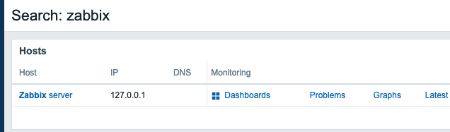

# Zabbix module Search Page plus


A lightweight frontend module for **Zabbix 7.0** designed to improve the User Experience (UX) on the global search results page. This module put "Dashboards" links in the first column and adds a clean, monochromatic icon to highlight the Dashboard link.




## 🚀 Features

* **Link Reordering**: Swaps "Latest data" and "Dashboards" in the Monitoring column to prioritize high-level views.
* **Native Look & Feel**: Includes a custom SVG icon that matches Zabbix 7.0's design system.
* **Non-Invasive**: Built using the native Zabbix Module system. No core files are modified, ensuring easy Zabbix updates.
* **Performance Focused**: Pure Vanilla JavaScript with zero external dependencies.

## 📂 Project Structure

```text
swap_links/
├── manifest.json            # Module metadata and asset registration
├── Module.php               # Base class for Zabbix integration
└── assets/
    └── js/
        └── search_results.js # DOM manipulation logic for search results
