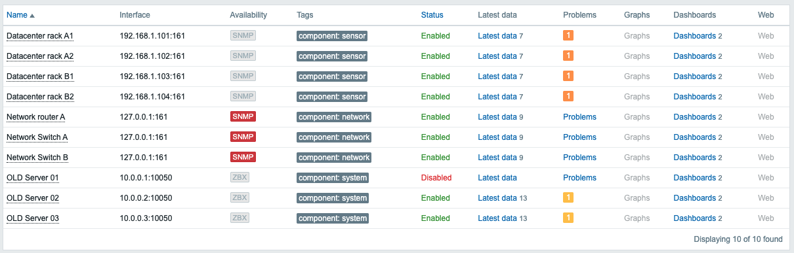
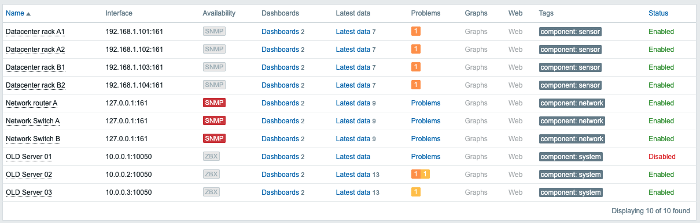

# Zabbix module: Search Page small improvement

A lightweight frontend module to improve Zabbix search results page. This module put "Dashboards" links in the first column and adds a clean, monochromatic icon to highlight the Dashboard link, to encourage user to explore host dashboards.


## 🚀 Features

* **Link Reordering**: Swaps "Latest data" and "Dashboards" in the Monitoring column to prioritize high-level views.
* **Native Look & Feel**: Includes a custom SVG icon that matches Zabbix 7.0's design system.
* **Non-Invasive**: Built using the native Zabbix Module system. No core files are modified, ensuring easy Zabbix updates.
* **Performance Focused**: Pure Vanilla JavaScript with zero external dependencies.

## 📂 Project Structure

```text
swap_links/
├── manifest.json            # Module metadata and asset registration
├── Module.php               # Base class for Zabbix integration
└── assets/
    └── js/
        └── search_results.js # DOM manipulation logic for search results
```

## What about "Monitoring > Host" ?
Altering columns order via module is harder here. If you want to emphasize "Dashboard" link, use the provided patch:

```text
cd /usr/share/zabbix/app/partials
patch monitoring.host.view.html.php < monitoring.host.view.html.php.PATCH
```

### Default screen:


### After patching:


